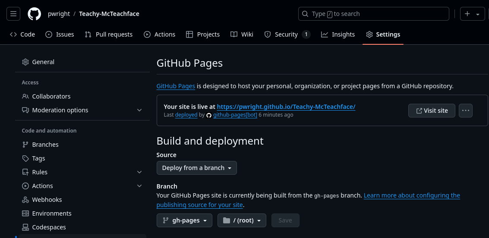

- This repo allows you create a tutors course without learning about the tutors filesystem.
  id:: 66dd6a46-c0c7-4162-be4c-df2b08eb48fd
	- Click **Use this template** on the [pwright/Teachy-McTeachface]( https://github.com/pwright/Teachy-McTeachface ) page.
	- Clone the resulting repo to your local machine.
	- Install [Logseq: A privacy-first, open-source knowledge base]( https://logseq.com/downloads ).
	  See [[unit-1-logseq/book-1/00.Basics]]
	- Open `<repo>/logseq` as a graph in Logseq.
	- Edit a few pages.
	- Commit and push changes.
	- Turn on **GitHub pages** for your repo.
	  
		- You now have a website of the content, but what about tutors?
	- Run `bash build-preview.sh` to generate the tutors filesystem.
-
- [[unit-2-tutors/book-1-about/00.About]]